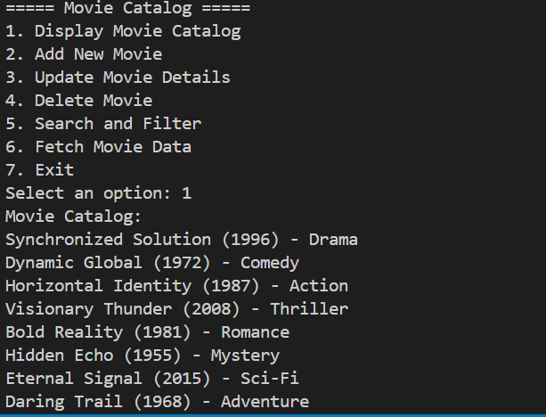
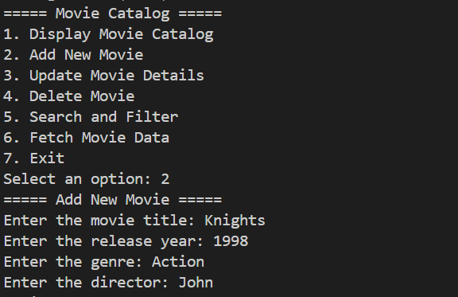
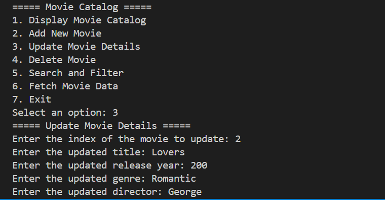
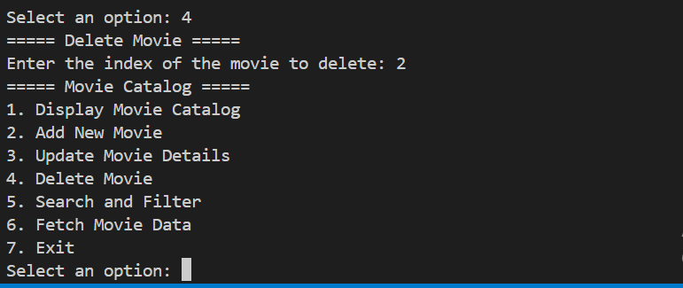
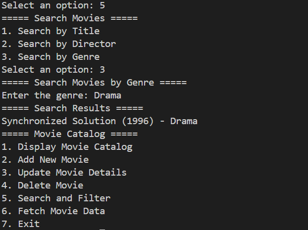
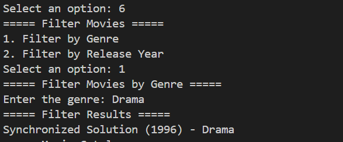

### Movie Catalog CLI Application
This is a simple CLI application that allows you to search for movies and add them to a list and other operations related to the movies actions.

### Description:
This project includes a Command Line Interface (CLI) application built using Node.js deigned to facilitate seamless management of a movie catalog. It leverages object-oriented programming, prototypes, arrays, ES6 features, async programming, HTTP requests using the Fetch API, file handling, and module usage.

### Features:

- **Display Movie Catalog:** Read movie data from a JSON file and display a list of movies in the catalog.

- **Add New Movie:** Allow users to add new movies to the catalog by providing details such as title, director, release year, and genre. The movie data should be stored in the JSON file.

- **Update Movie Details:** Enable users to edit the details of a specific movie by selecting the movie from the catalog and updating its properties like title, director, release year, and genre.

- **Delete Movie:** Allow users to remove a movie from the catalog by selecting the movie and deleting it from the JSON file.

- **Search and Filter:** Implement search functionality that allows users to search for movies by title, director, or genre. Additionally, provide options for filtering the movie catalog based on specific criteria like genre or release year.

- **Fetch Movie Data:** Utilize the Fetch API to make HTTP requests to a movie database API (such as OMDB API) to fetch additional movies from the API and store it in the JSON file.

### Notes: 
* **Modules:** Organize the application into module components to enhance maintainability and scalability. Separate modules for file handling, movie management, API requests, and user interaction ensure clear separation of concerns.

* **Async Programming:** Employ  asynchronous programming paradigm such as  Promises or async/await to handle file read/write operations and API requests.

### Examples

    

       
-Display all movies:
 
    

  

       
Add New Movie:  

    

  

       
Update a Movie

    

  

       
Delete a Movie

    

  

       
Search a Movie 

    

  

       
Fetch data of Movie 

    

